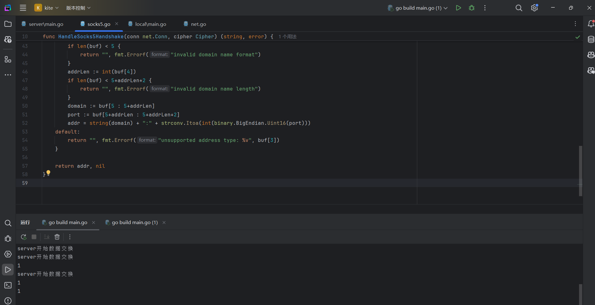

# reimagined-octo-tribble
# 经过几次失败,3.py可以传输一些简单的数据.
# 2021/7/25更新，除了个别文件外都可以传输一些简单的数据.
# 2021/7/29更新,function.go 是一个伟大的进步！！！
# 2021/7/31更新，在7月最后一天，我成功了！！！successul.go是最终成果，之前的文件其实只是出了一点小错，今天终于知道错在哪里了！！！
# header:=make([]byte,22)
# len,_:=conn.Read(header)
# //此时len显示为3，但是打印header为{0x05,0x01,0x00,0,0......},0会占位，导致host和port获得时会将后面的0代进去，导致程序编译没问题，但是一运行就出错。通过io.ReadFull()函数进行读取header可以避免一系列的错误！！！
# https://gist.github.com/felix021/7f9d05fa1fd9f8f62cbce9edbdb19253和https://github.com/WilliamColton/reimagined-octo-tribble/blob/main/successful.go可以用来参考。
# 时隔数年，再度更新（2024 2/20 早2：42（没错是凌晨） 在昨日发现一个很好用的框架Goframe后，彻夜研究，终于实现了第一个带加解密的半成功品，实属不易，接下来不会在此更新了，而是在第一个成功品出来之后重新开一个仓库正式更新） ProxyServer和ProxyLocal文件夹下面的就是我的半成功品，chatgpt4.0在过程中出了很大的力，从中受益颇多，当然也和我这些年的进步密不可分


# 最终，2024年2月19日，第一个可以在本机运行的版本出来了，就放在src目录下

分界线
下面开始是2024 8/17写的了
```
func reverse(data []byte) []byte {
	for i, j := 0, len(data)-1; i < j; i, j = i+1, j-1 {
		data[i], data[j] = data[j], data[i]
	}
	return data
}

func handleSocks5Handshake(conn net.Conn) string {
	buf := make([]byte, 2048)
	conn.Read(buf)

	conn.Write(reverse([]byte{0x05, 0x00}))

	n, _ := conn.Read(buf)
	buf = reverse(buf[:n])

	var addr string
	switch buf[3] {
	case 0x01: // IPv4 地址
		ip := buf[:4]
		port := buf[4:]
		addr = net.IP(ip).String() + ":" + strconv.Itoa(int(binary.BigEndian.Uint16(port)))
	case 0x03: // 域名地址
		addrLen := int(buf[4])
		domain := buf[5 : 5+addrLen]
		port := buf[5+addrLen:]
		addr = string(domain) + ":" + strconv.Itoa(int(binary.BigEndian.Uint16(port)))
	}

	successResponse := reverse([]byte{0x05, 0x00, 0x00, 0x01, 0x00, 0x00, 0x00, 0x00, 0x00, 0x00})
	conn.Write(successResponse)

	return addr
}
```
# 2024 8/17 20：28：08秒记：成功进行socks5握手！！！
# 伟大的进步哈哈哈哈！！！
kitw.zip即现在的代码，运行起来特别卡，但是我已经有了优化的想法，开干！！！同日20：44：50留

# 2024 8/19 凌晨0：34：45留，日狗了，维修了一天，一直以为是数据交换的问题，结果现在发现是socks5最后没有发送[]byte{0x05, 0x00, 0x00, 0x01, 0x00, 0x00, 0x00, 0x00, 0x00, 0x00}。。。。。无语住了。。。。


# 2024 8/19 凌晨0:49:17秒留，终于成功了，之前我留了一个说成功了，但是是不是真成功了呢？我忘记了，但是现在这个是百分百可以正常使用的（在本机运行），3年，终于成功了，不枉费我3年努力呜呜呜呜呜呜，最终代码就在kite(2).zip中了。
